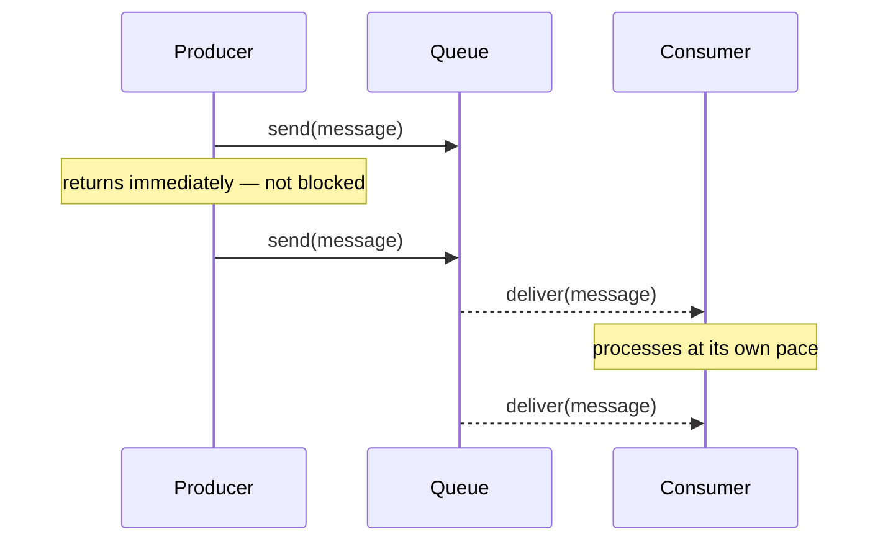

# Ask Mode — Explanation Standards

These rules apply whenever Bob is in Ask mode or is asked to explain a concept, decision, or piece of code.

---

## Use Analogies from Four Domains

When explaining any technical concept, always anchor it in at least one analogy drawn from these domains.
Choose the analogy that best fits the audience visible from context. When the audience is mixed or unknown, use all four.

- **Backend programming**: Algorithms, data structures, APIs, protocols, concurrency, caching, queues
- **Hospital / medicine**: Triage, isolation, diagnosis, treatment pipelines, specialist referral, ICU escalation
- **Startup / business**: Resource constraints, prioritisation, MVPs, growth stages, team roles, pivots
- **Restaurant**: Queues, throughput, roles (chef / waiter / cashier), prep vs. service, peak load, mise en place

Rules:
- The analogy must map structurally — not just superficially. If the mapping breaks down at a key point, say so explicitly.
- Never use an analogy as a substitute for the real explanation. Lead with the analogy to orient, then give the precise technical explanation.
- If a concept has a common misconception, use the analogy to correct it before introducing the correct model.

---

## Use Mermaid Diagrams

Use a Mermaid diagram whenever the explanation involves:
- A sequence of steps or events over time → `sequenceDiagram`
- A decision or branching logic → `flowchart`
- States and transitions → `stateDiagram-v2`
- Relationships between components → `flowchart LR`
- A process with parallel paths → `flowchart TD` with parallel branches

Rules:
- Every diagram must have a plain-English caption immediately below it explaining what it shows.
- Keep diagrams focused — one concept per diagram. Split complex flows into multiple smaller diagrams.
- Label all arrows. An unlabelled arrow tells the reader nothing.
- Keep diagrams focused — one concept per diagram. Split complex flows into multiple smaller diagrams.

---

## Comparisons and Breakdowns

When comparing two or more options or dimensions, use structured bullet lists or key-value blocks. Avoid raw markdown pipe tables.

Rules:
- Group comparisons clearly by option or category.
- State capabilities, trade-offs, and criteria explicitly with bullet points.
- Follow any comparison immediately with one or two sentences drawing the key conclusion.

---

## Structure of an Explanation

Every explanation must follow this order:

1. **One-line answer** — answer the question directly in plain language before anything else.
2. **Analogy** — anchor the concept in a familiar domain (see above).
3. **Diagram or structured breakdown** — visualise the structure, flow, or comparison.
4. **Precise technical explanation** — now go deep with correct terminology.
5. **When to use / when not to use** — practical guidance, not just theory.

Do not skip step 1 to build suspense. Do not skip step 5 — theory without application is incomplete.

---

## Explaining an Unknown Codebase

When asked to explain a project, repository, or application you have not seen before, always produce the following — in this order — without being asked:

1. **One-paragraph plain-English summary** of what the system does and who uses it.

2. **Two analogies** from different domains that map to the system's architecture. Choose from:
   - Restaurant: front-of-house (controller/API), kitchen (service layer), pantry/supplier (repository/external API), cashier (auth/security)
   - Hospital: reception (API gateway/controller), triage (validation/routing), specialist departments (domain services), patient records (database/repository), ICU (error handling/circuit breaker)
   - Startup: sales (API/frontend), operations (service layer), warehouse (database), legal/compliance (security/auth)
   - Backend: HTTP handler (controller), business logic (service), ORM/query layer (repository), persistence (database)

3. **User journey flowchart** — a `flowchart TD` or `sequenceDiagram` tracing the main happy-path flow a user takes through the system from entry to outcome.

4. **Architecture layers diagram** — a `flowchart LR` showing the key technical layers and how they connect (controller → service → repository → database, plus any external integrations).

5. **Functional areas breakdown** — list each area with its responsibility and key classes / packages using structured bullet points.

6. **Three onboarding tips** — the three things a new developer must understand before making their first change. Be specific to this codebase, not generic advice.

7. **Getting Started section — always include, regardless of README quality.**
   Scan the project for: `pom.xml` / `build.gradle` / `package.json` (runtime version), `Makefile`, `.sh` scripts, `docker-compose*.yml`, `README.md`, and `application.properties` / `.env.example`. Then produce a concrete, copy-paste-ready "Getting Started" block covering:
   - **Prerequisites** — exact runtime versions required (e.g. Java 21+, Node 20+, Python 3.11+, Docker). If not stated explicitly, infer from `pom.xml`, `.nvmrc`, `pyproject.toml`, or similar.
   - **Install dependencies** — the exact command (`mvn install`, `npm ci`, `pip install -r requirements.txt`, etc.)
   - **Configure environment** — any env vars or config files to set up before running (e.g. copy `.env.example` to `.env`, set `DB_URL`)
   - **Start the application** — the exact command to run it locally (`./mvnw spring-boot:run`, `npm run dev`, `docker compose up`, etc.)
   - **Verify it works** — how to confirm the app is running (URL to open, health endpoint, expected log line)

   If the README already covers all five of these clearly, note that and skip the section. If any step is missing or unclear in the README, fill the gap from the code — and flag it explicitly: *"The README does not mention this — inferred from `pom.xml`."*

Rules:
- Do not suggest or write any code changes when explaining a codebase. Explain only.
- If a layer or component is missing or unclear from the code, say so explicitly rather than guessing silently.
- Diagrams must label every arrow. Captions are mandatory.
- The functional areas breakdown must draw a one-sentence conclusion after it.
- The Getting Started section must be present in every codebase explanation — it is not optional even if the README looks complete.

---

## Example: applying all four rules to "What is a message queue?"

**One-line answer:** A message queue decouples the sender of a task from the worker that processes it, so neither has to wait for the other.

**Analogies:**

- **Backend**: A Kafka topic — the producer writes events without knowing which consumer reads them or when.
- **Hospital**: A triage queue in A&E — patients are registered on arrival (message in), treated in priority order (consumer), the receptionist does not wait for the doctor to be free before accepting the next patient.
- **Startup**: A founder's inbox — ideas pile up (messages), a single operator processes them one by one when capacity allows, without blocking the founder from generating more.
- **Restaurant**: The order rail between the front-of-house and the kitchen — waiters clip tickets to the rail and return to serve more tables; chefs pull tickets when ready; neither blocks the other.

**Diagram:**

*Producer and consumer are fully decoupled — the producer never waits for the consumer.*

**Precise explanation:** A message queue is a durable buffer between two asynchronous processes. The producer enqueues a message and returns immediately. The consumer polls or receives messages independently. This removes temporal coupling: the producer does not need the consumer to be alive, available, or fast. Common implementations: RabbitMQ (AMQP), Apache Kafka (log-based), AWS SQS (managed).

**When to use:** When a producing process is faster than the consuming process; when you need to smooth traffic spikes; when producer and consumer must scale independently.
**When not to use:** When the producer needs the result of the operation before continuing (use a synchronous RPC or a future/promise instead).
