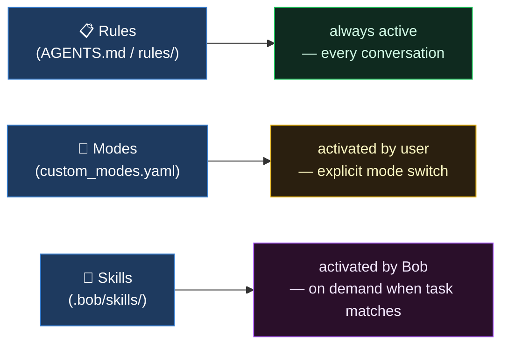

# IBM Bob 2.x — Team Presentation
### "Your AI SDLC Partner in Action"

**Audience:** Junior Developers & Project Owners with decent Gen-AI knowledge  
**Format:** Slides + Live Demo  
**Estimated time:** ~45 min total (25 min slides + 20 min demo)

---

## Table of Contents

1. [What is IBM Bob?](#1-what-is-ibm-bob)
2. [The Three Modes](#2-the-three-modes)
3. [The Chat Interface & Context Mentions](#3-the-chat-interface--context-mentions)
4. [Auto-Approve & Permission Model](#4-auto-approve--permission-model)
5. [Literate Coding](#5-literate-coding)
6. [Project Memory: /init, AGENTS.md & Custom Rules](#6-project-memory-init-agentsmd--custom-rules)
    - [6b. Lifecycle Hooks](#6b-lifecycle-hooks)
7. [Slash Commands](#7-slash-commands)
    - [/review — Built-in Code Review](#review--built-in-code-review-workflow)
8. [Todo Tracking & Rollback](#8-todo-tracking--rollback)
    - [8b. Skills](#8b-skills)
9. [Subagents & Subtasks](#9-subagents--subtasks)
10. [Custom Modes](#10-custom-modes)
11. [MCP — Extending Bob](#11-mcp--extending-bob)
    - [11a. MCP in Practice: The Memory Knowledge Graph](#11a-mcp-in-practice-the-memory-knowledge-graph)
12. [DEMO: Build a Spring Boot Weather API](#12-demo-build-a-spring-boot-weather-api)
    - [12b. Ready-to-Use Prompt Playbook](#12b-ready-to-use-prompt-playbook)
13. [Tips for Getting the Most from Bob](#13-tips-for-getting-the-most-from-bob)
14. [Q&A](#14-qa)

---

## 1. What is IBM Bob?

IBM Bob is an **AI SDLC partner** — not just autocomplete, but a full agentic assistant that reasons across your codebase, plans features, implements code across multiple files, and executes terminal commands, all inside your IDE.

> 💡 *If you've used GitHub Copilot or Claude Code, Bob will feel immediately familiar — and then go further.* Copilot's agent mode and Claude Code can both edit files and run terminal commands — so that bar has been raised across the industry. Where Bob goes further is in the **structure** it puts around that power: hard-enforced modes that cap what the AI can do, a persistent memory system that survives across sessions, a skills library your whole team shares, and an approval model that keeps you in control at every step — none of which the other tools offer natively.

**Key differentiators vs. Copilot agent mode and Claude Code:**

| Capability | GitHub Copilot (agent) | Claude Code | IBM Bob |
|---|---|---|---|
| Multi-file edits & terminal commands | ✅ | ✅ | ✅ |
| Reads your actual codebase | ✅ | ✅ | ✅ |
| Hard-enforced tool ceilings per mode | ❌ | Partial (`plan`/`acceptEdits`/`dontAsk` modes exist, but no per-action-type ceiling) | ✅ |
| Persistent project memory | Partial (`.github/copilot-instructions.md`, single file) | Partial (`CLAUDE.md` + `.claude/rules/` directory, similar concept but no mode-specific variants) | ✅ Full layered system with mode-specific rules |
| Structured approval model per action type | Partial (allow/deny per tool via flags, no per-session UI) | Partial (permission modes + `--allow-tool`/`--deny-tool`, no granular per-action-type UI) | ✅ Per-action-type, toggleable in UI |
| Team-shareable skills library | ❌ | ❌ | ✅ |
| Subagents + subtasks as first-class primitives | Partial (Cloud Agent opens PRs autonomously; no subtask UI concept) | Partial (subagents only, no subtask breadcrumb UI) | ✅ |
| MCP server integration | ✅ | ✅ | ✅ |
| Fixed 270,000-token context window | ❌ (varies by model/plan) | ❌ (varies by model/plan) | ✅ |

> 💡 *For Project Owners:* Think of Bob as an autonomous junior developer you can pair with any engineer, that never loses context about your project conventions, always asks before making changes, and can be rolled back instantly.

---

## 2. The Three Modes

Bob ships with three **purpose-built modes**. Each mode restricts Bob to a specific set of tools, keeping its behaviour predictable and safe.

> 💡 *Familiar concept:* Think of modes like **database transaction isolation levels** — each one draws a boundary around what can be seen and changed. Agent mode is `READ WRITE` (full access). Ask mode is `READ ONLY` (no side effects). Plan mode is somewhere in between. Claude Code has a similar concept (`plan` mode, `acceptEdits` mode), but in Bob the boundaries are defined per-mode by an explicit tool list — not a flag you pass at startup — making them composable, team-shareable, and version-controlled in `.bob/custom_modes.yaml`.

| Mode | Purpose | Tools available | When to use |
|------|---------|-----------------|-------------|
| **Plan** | Architecture & design | Read, Edit, MCP, Skill, Subagent, Mode | Before writing code — design phase |
| **Agent** | Write, edit & run code | Full access (Read, Edit, Execute, MCP, Skill, Todo, Subtask, Subagent, Mode) | Day-to-day implementation & debugging |
| **Ask** | Q&A and analysis | Read, MCP, Skill, Subagent (explore only), Mode | Understanding code, no changes needed |

**Recommended workflow:**
```
Plan mode → review the plan → Agent mode → implement → Ask mode → understand what was built
```

> 💡 Switch modes with `/plan`, `/agent`, `/ask` or the mode picker at the bottom of the sidebar.

### Modes in the Weather API context

Here is how you would use each mode as the Weather API grows from a skeleton to a production service:

| Stage | Mode | Example prompt |
|-------|------|---------------|
| Design the real-weather-API integration | **Plan** | *"Plan how to replace the hardcoded WeatherResponse with a live call to OpenWeatherMap. Consider error handling, API key configuration, and caching."* |
| Implement the OpenWeatherMap client | **Agent** | *"Implement the plan. Add a WeatherClient service that calls the OpenWeatherMap current weather API and maps the response to WeatherResponse."* |
| Understand what was built | **Ask** | *"@/src/main/java/com/example/weather/WeatherClient.java — explain how the HTTP client handles timeouts and what happens when the external API is unavailable."* |
| Add a React frontend | **Agent** | *"Scaffold a React + Vite frontend in /frontend that calls GET /weather and renders the city and temperature."* |
| Add Actuator / observability | **Agent** | *"Add spring-boot-starter-actuator and expose /actuator/health and /actuator/metrics. Configure a custom WeatherRequestCounter micrometer metric."* |
| Review before a PR | **Ask** | *"@/src/main/java/com/example/weather — review the entire weather package for REST best practices, missing error handling, and hardcoded values."* |

---

## 3. The Chat Interface & Context Mentions

The **agentic chat sidebar** is Bob's primary workspace. It lets you write natural language requests, reference specific files or errors using **context mentions**, and watch Bob's step-by-step reasoning in real time.

### Context Mention types

| Syntax | What it injects |
|--------|----------------|
| `@/src/WeatherController.java` | Full file contents |
| `@/src/service` | All files in that folder (non-recursive) |
| `@problems` | Current errors & warnings from the Problems panel |
| `@terminal` | Recent terminal output |
| `@git-changes` | Uncommitted diff |
| `@a1b2c3d` | A specific git commit diff |
| `@https://...` | Content from a URL |

**Shortcut:** Highlight any code in the editor → `Cmd+L` (Mac) / `Ctrl+L` (Win/Linux) → instantly sends it to chat.

> 💡 Combine multiple mentions: *"Fix `@problems` in `@/src/api/WeatherController.java`"*

---

## 4. Auto-Approve & Permission Model

Every action Bob wants to take is presented for your approval. You can configure **auto-approve** per action type to speed up trusted workflows.

> 💡 *Familiar concept:* This is **IAM / RBAC** for your AI session — the same mental model as AWS IAM roles or Kubernetes RBAC. Each action type (Read, Edit, Execute, MCP…) is a permission. Auto-approving it is like granting a role to a service account: convenient, but sized to the principle of least privilege. Keep the high-risk ones (Edit, Execute) on manual until you trust the workflow.

| Action | Risk level | What it allows |
|--------|------------|----------------|
| Read | Medium | View files & directories |
| Edit | **High** | Create, edit, save files |
| Execute | **High** | Run terminal commands |
| MCP | Medium-High | Use configured MCP servers |
| Skill | Medium | Activate defined skills |
| Todo | Low | Update the task checklist |
| Subtask | Low | Create & complete subtasks |
| Subagent | Low | Spawn background agents |
| Mode | Low | Switch modes |

> 🎯 **Demo tip:** Keep **Edit** and **Execute** on manual approval — the audience sees every proposed change before it lands.

---

## 5. Literate Coding

Write instructions **directly in your editor** in plain language — Bob converts them to real code inline.

> 💡 *Familiar concept:* Think of it as **Javadoc or JSDoc taken one step further** — instead of writing a comment that describes what the code does, you write the intent and Bob writes the code. If you've used Copilot's inline suggestions, the feel is similar: you're in the editor, the suggestion appears inline. The difference is you initiate it deliberately, and you review a full file diff before anything is saved.

**How it works:**
1. Open a file in the editor
2. Press `Cmd+I` (Mac) / `Ctrl+I` (Win/Linux) — or click the magic wand icon
3. Type a natural language instruction where the code should go (text appears in **blue**)
4. Press `Cmd+Enter` — Bob generates a diff inline
5. Accept (`Cmd+Enter`) or reject (`Cmd+Shift+Backspace`)

**Best for:**
- Adding wrapper logic (retry, error handling, logging)
- Targeted refactoring of a specific block
- Quick, precise changes without opening chat

**Not ideal for:** Multi-file changes — use Agent mode chat for those.

> 💡 *Demo impact:* The blue instruction text turning into a green/red diff is immediately clear to any audience.

---

## 6. Project Memory: /init, AGENTS.md & Custom Rules

LLMs are stateless — each new conversation starts from scratch. Bob solves this through a layered rules system that persists context across sessions.

Bob has three mechanisms for injecting persistent context — they all add text to the conversation without you typing it manually, but differ in *when* and *how* they activate:



### /init & AGENTS.md

> 💡 *Familiar concept:* If you've used GitHub Copilot's `.github/copilot-instructions.md` or Claude Code's `CLAUDE.md`, `AGENTS.md` is exactly that idea — a markdown file committed to the repo that tells the AI about your project conventions. Bob takes it further: `/init` generates it automatically by scanning the codebase, and creates **mode-specific variants** so Plan mode and Agent mode each get their own tailored context file. Neither Copilot nor Claude Code have mode-scoped rule files — they load a single instructions file for every session.

**What `/init` does:**
- Scans your project structure, tech stack, and conventions
- Generates a root-level `AGENTS.md` — Bob reads this at the start of every conversation
- Creates mode-specific files in `.bob/` for Plan, Agent, and Ask modes

**`AGENTS.md` typically includes:**
- Project overview and purpose
- Directory structure and key file locations
- Technology stack and dependencies
- Architectural patterns and coding conventions
- Development workflows

**Re-run `/init` when:**
- Adding new modules or services
- Changing directory structure
- Onboarding new team members to Bob

> 💡 *For Project Owners:* Manually add business rules, deployment conventions, and team practices to `AGENTS.md` — things Bob's scan can't auto-detect.

### Custom Rules

**Custom rules** are the broader system `AGENTS.md` lives inside. They let you shape Bob's coding style, documentation standards, testing methodology, and decision-making — persistently, without repeating yourself in every prompt.

> 💡 *Familiar concept:* Custom rules are **ESLint / Checkstyle config for Bob's behaviour** — the same idea as a linter ruleset, but instead of enforcing code style at save time, they enforce how the AI reasons and responds. Just as `.eslintrc` or `checkstyle.xml` is committed to the repo so every developer gets the same rules, `.bob/rules/` is committed so every Bob session on the project gets the same guidelines.

**Two scopes:**

| Scope | Location | Applies to |
|-------|----------|-----------|
| **Global** | `~/.bob/rules/` (Linux/Mac) or `%USERPROFILE%\.bob\rules\` (Windows) | All projects on your machine |
| **Workspace** | `.bob/rules/` in your project root | This project only |

Workspace rules override global rules when both exist. Within each scope, mode-specific rules load before general rules.

**Directory structure:**

```
.bob/
├── rules/              ← applies to all modes in this project
├── rules-agent/        ← Agent mode only
├── rules-plan/         ← Plan mode only
├── rules-ask/          ← Ask mode only
└── rules-{custom-slug}/← any custom mode (e.g. rules-devops/)
```

Files load in **alphabetical order** and are combined with any `customInstructions` set in `custom_modes.yaml`. Empty files, cache files, and `.DS_Store` are silently skipped.

**Rule priority (highest to lowest):**
1. Mode-specific workspace rules (`.bob/rules-agent/`)
2. General workspace rules (`.bob/rules/`)
3. Mode-specific global rules (`~/.bob/rules-agent/`)
4. General global rules (`~/.bob/rules/`)

> ⚠️ **Keep rules files short.** Rules are injected into every conversation — a 150-line rules file costs roughly 2,700 tokens of your 270,000-token context window. Every token spent on standing rules is a token not available for your code. Put only what you truly need in every conversation; anything task-specific belongs in a skill instead. You can hover over the rules indicator in the Bob sidebar to see exactly how many tokens your current rules file is consuming.

---

**Weather API — practical rules setup:**

Create the rules directories and seed them:
```bash
mkdir -p .bob/rules .bob/rules-agent .bob/rules-ask
```

`.bob/rules/coding-style.md` — applies to all modes:
```markdown
# Weather API — Coding Standards

## Java
- Use Java records for immutable response DTOs (e.g. WeatherResponse) — no Lombok needed for these
- Use constructor injection only — no @Autowired field injection
- Use Lombok @RequiredArgsConstructor on @Service/@Component classes to generate the constructor for all final fields
- Use Lombok @Slf4j for loggers — no manual `private static final Logger log = ...` declarations
- Use Lombok @Data + @NoArgsConstructor for mutable request body DTOs that Jackson must deserialize
- Never use Lombok @Data on JPA @Entity classes — use explicit getters/setters to avoid Hibernate pitfalls
- All public methods must have Javadoc
- Lombok version: 1.18.34 (scope: provided)

## REST
- Return RFC 7807 ProblemDetail for all error responses
- Use @Valid on all @RequestBody parameters
- Never expose stack traces in HTTP responses

## Configuration
- All external values (API keys, URLs, timeouts) must be in application.properties
- Prefix all app-specific properties with `weather.`
```

`.bob/rules-agent/testing.md` — applies only in Agent mode:
```markdown
# Testing Rules (Agent mode)

- Always write a unit test alongside any new controller method
- Unit tests use @WebMvcTest + MockMvc
- Integration tests use @SpringBootTest(webEnvironment = RANDOM_PORT)
- Test method names follow: should_<expectedBehaviour>_when_<condition>
- Assert HTTP status before asserting response body
```

`.bob/rules-ask/review.md` — applies only in Ask mode:
```markdown
# Review Rules (Ask mode)

When reviewing code, always structure the response as:
1. Summary of what the code does
2. Issues found (severity: HIGH / MEDIUM / LOW, with file and line number)
3. Suggestions (optional — only if explicitly asked)
Never modify files in Ask mode.
```

**Team standardisation — commit everything:**
```bash
git add .bob/rules/ .bob/rules-agent/ .bob/rules-ask/
git commit -m "Add Bob custom rules for Weather API"
```

> 💡 *Writing effective rules — three principles:*
> - **Be specific:** "Use 4 spaces for indentation in Java files" beats "format code nicely"
> - **Be actionable:** Rules should constrain a decision, not describe an aspiration
> - **Organise by topic:** One file per concern (coding-style, testing, documentation) makes rules easy to update

---

## 6b. Lifecycle Hooks

**Lifecycle hooks** let you run shell commands automatically at specific points in a Bob session — to log activity, inject context into the model, gate or block actions, or trigger follow-up automation. No Bob modifications required.

> 💡 *If you know Git hooks, this will feel familiar.* Both intercept actions at defined points and can block them by exiting with a non-zero code. The key difference: **Git hooks guard your repository** — they fire when code is committed or pushed, regardless of what triggered the change. **Bob hooks guard your AI session** — they fire when Bob is about to act (read a file, write a file, run a command), before Git is ever involved. They complement each other: Bob hooks catch things at the AI layer, Git hooks catch the same code again at the commit layer.

### Supported hooks

| Hook | When it runs | Blocking | Stdout behaviour |
|------|-------------|----------|-----------------|
| `SessionStart` | Once when a session begins | No | Injected as model context |
| `UserPromptSubmit` | Each time you submit a prompt | Yes (exit `2`) | Injected alongside the prompt |
| `PreToolUse` | Before a matched tool runs | Yes (exit `2`) | Ignored |
| `PostToolUse` | After a matched tool completes | No | Ignored |
| `Stop` | When the agent stops | No | Ignored |

Only `UserPromptSubmit` and `PreToolUse` can **block** an action. Exiting with code `2` from either will stop the prompt or tool from proceeding. Exit `2` from any other hook is logged and ignored.

### Configuration

Hooks are defined under the `hooks` key in `settings.json`. Bob merges from two locations:

| Scope | File |
|-------|------|
| Global (all workspaces) | `~/.bob/settings/settings.json` |
| Workspace (this project) | `.bob/settings.json` |

Global hooks always run. Workspace hooks are merged on top and apply only to the current project.

**Schema:**
```json
{
  "hooks": {
    "PreToolUse": [
      {
        "matcher": "^write_file$",
        "hooks": [
          {
            "type": "command",
            "command": "sh .bob/hooks/check.sh",
            "timeout": 5
          }
        ]
      }
    ]
  }
}
```

`matcher` is a regex matched against the tool name (`PreToolUse` / `PostToolUse` only). Omit it to match all tools. `timeout` defaults to 10 seconds; set to `0` to disable.

---

### Weather API — four practical hook examples

**1. `SessionStart` — inject live project context into every session**

Automatically tells Bob what branch you're on and whether the app is currently running — without you typing it:

`.bob/hooks/session-context.sh`:
```bash
#!/bin/sh
echo "Project: Weather API (Spring Boot 4.x, Maven)"
echo "Git branch: $(git rev-parse --abbrev-ref HEAD 2>/dev/null || echo 'unknown')"
echo "Java version: $(java -version 2>&1 | head -1)"
echo "App running: $(curl -s -o /dev/null -w '%{http_code}' http://localhost:8080/actuator/health 2>/dev/null || echo 'not running')"
```

`.bob/settings.json`:
```json
{
  "hooks": {
    "SessionStart": [
      {
        "hooks": [{ "type": "command", "command": "sh .bob/hooks/session-context.sh" }]
      }
    ]
  }
}
```

Bob receives this as context at session start — it knows the branch and whether the running instance is healthy before you type your first prompt.

---

**2. `PreToolUse` — block writes outside `src/` to protect the project structure**

Prevents Bob from accidentally writing files to the project root or unintended directories:

`.bob/hooks/guard-src.sh`:
```bash
#!/bin/sh
PATH_VAL=$(cat | python3 -c "import sys,json; print(json.load(sys.stdin)['input'].get('path',''))")
case "$PATH_VAL" in
  src/*|.bob/*|test/*)
    exit 0
    ;;
  *)
    echo "Blocked: writes outside src/, .bob/, or test/ are not permitted" >&2
    exit 2
    ;;
esac
```

`.bob/settings.json`:
```json
{
  "hooks": {
    "PreToolUse": [
      {
        "matcher": "^write_file$",
        "hooks": [{ "type": "command", "command": "sh .bob/hooks/guard-src.sh", "timeout": 5 }]
      }
    ]
  }
}
```

Bob attempts to write a file → hook reads the `input.path` → if it's outside allowed directories, exit `2` blocks the write and Bob reports the tool as blocked.

---

**3. `PostToolUse` — auto-run tests after every file write**

Every time Bob writes a Java file, the test suite runs immediately so you see failures before the next step:

`.bob/hooks/run-tests-on-write.sh`:
```bash
#!/bin/sh
PATH_VAL=$(cat | python3 -c "import sys,json; print(json.load(sys.stdin)['input'].get('path',''))")
case "$PATH_VAL" in
  src/main/java/*)
    echo "Java source changed — running tests..." >&2
    mvn test -q --no-transfer-progress 2>&1 | tail -20 >&2
    ;;
esac
```

```json
{
  "hooks": {
    "PostToolUse": [
      {
        "matcher": "^write_file$",
        "hooks": [{ "type": "command", "command": "sh .bob/hooks/run-tests-on-write.sh", "timeout": 60 }]
      }
    ]
  }
}
```

> ⚠️ `PostToolUse` is non-blocking. Test failures are logged but will not stop Bob from continuing. Use this for visibility, not gating.

---

**4. `Stop` — auto-commit staged changes when Bob finishes a session**

When Bob completes a scaffolding or refactoring session, any staged changes are committed automatically with a timestamped message:

`.bob/hooks/auto-commit.sh`:
```bash
#!/bin/sh
cd "$PWD"
if ! git diff --cached --quiet; then
  BRANCH=$(git rev-parse --abbrev-ref HEAD)
  git commit -m "chore(bob): auto-commit from Bob session on ${BRANCH} at $(date -u +'%Y-%m-%dT%H:%M:%SZ')"
  echo "Auto-committed staged changes." >&2
fi
```

```json
{
  "hooks": {
    "Stop": [
      {
        "hooks": [{ "type": "command", "command": "sh .bob/hooks/auto-commit.sh" }]
      }
    ]
  }
}
```

---

**Complete `.bob/settings.json` for the Weather API — all four hooks combined:**
```json
{
  "hooks": {
    "SessionStart": [
      {
        "hooks": [{ "type": "command", "command": "sh .bob/hooks/session-context.sh" }]
      }
    ],
    "PreToolUse": [
      {
        "matcher": "^write_file$",
        "hooks": [{ "type": "command", "command": "sh .bob/hooks/guard-src.sh", "timeout": 5 }]
      }
    ],
    "PostToolUse": [
      {
        "matcher": "^write_file$",
        "hooks": [{ "type": "command", "command": "sh .bob/hooks/run-tests-on-write.sh", "timeout": 60 }]
      }
    ],
    "Stop": [
      {
        "hooks": [{ "type": "command", "command": "sh .bob/hooks/auto-commit.sh" }]
      }
    ]
  }
}
```

**Project structure after adding hooks:**
```
.bob/
├── settings.json          ← hook configuration
├── hooks/
│   ├── session-context.sh ← SessionStart: inject branch + health
│   ├── guard-src.sh       ← PreToolUse:   block writes outside src/
│   ├── run-tests-on-write.sh ← PostToolUse: run mvn test after writes
│   └── auto-commit.sh     ← Stop:         commit staged changes
├── rules/
│   └── coding-style.md
├── rules-agent/
│   └── testing.md
└── agents/
    ├── pr-summarizer.md
    └── code-reviewer.md
```

> 💡 *For teams:* Commit `.bob/hooks/` and `.bob/settings.json` to version control alongside your other `.bob/` config. Every team member gets the same session guards and automation immediately on clone.

> ⚠️ *Current limitations:* Only `command` hooks are supported. Hooks cannot rewrite prompt or tool input before it reaches the model. Hooks run with your full user permissions — no sandboxing is applied.

---

## 7. Slash Commands

Slash commands let you trigger actions, switch modes, and run **custom reusable prompts** without re-typing instructions.

> 💡 *Familiar concept:* Slash commands are **npm scripts for your AI workflows** — named shortcuts that wrap a repeatable action. If you've built up a library of prompts in Claude or ChatGPT that you copy-paste every session, slash commands are the equivalent committed to the repo: versioned, shared with the team, and available on clone with no setup.

### Built-in commands

| Command | Effect |
|---------|--------|
| `/init` | Generate `AGENTS.md` for the project |
| `/agent`, `/plan`, `/ask` | Switch modes instantly |
| `/review` | AI-powered code review — see below |
| `/permissions` | Check and change the workspace trust level |

### `/review` — built-in code review workflow

`/review` opens a dedicated **Review panel** in the sidebar. Bob diffs your selected branches, runs automated analysis, and surfaces findings in the **Bob Findings panel** — all with auto-approval (no manual confirmation needed per step).

**Usage variants:**

| Command | What it reviews |
|---------|----------------|
| `/review` | Local uncommitted changes in the working directory |
| `/review <branch>` | Diff between `<branch>` and your current HEAD |
| `/review #<issue>` `--issue-coverage` | Validates local changes actually address a GitHub issue |
| `/review <issue-url>` `--issue-coverage` | Same, using a full GitHub issue URL |

**What Bob analyses:** bug detection, security issues, performance problems, style consistency.

**How to use the Review panel:**
1. Run `/review` — the Review panel opens in the sidebar
2. Select the branch to compare against (local, remote, or repo default)
3. Toggle **Include Uncommitted Changes** if needed
4. Optionally link a GitHub issue to validate coverage
5. Click **Start Review** — findings appear in the Bob Findings panel

> 💡 *For Project Owners:* Use `/review #<issue>` `--issue-coverage` before raising a PR to verify that the implementation actually addresses the ticket requirements — not just that it compiles and passes tests.

> ⚠️ Branch comparisons work with both GitHub and GitLab. Issue validation (`--issue-coverage`) requires a GitHub account and issue URL.

**Weather API — practical use:**
```
/review main --issue-coverage
```
Run this before every PR on the Weather API to catch bugs, security issues in `WeatherClient`, and verify that the OpenWeatherMap integration addresses the linked ticket.

---

### Creating custom commands

Create a markdown file in `.bob/commands/` — the filename becomes the command:

```
.bob/commands/
├── test-api.md       →  /test-api
└── security-check.md →  /security-check
```

> ⚠️ Do not name a custom command file `review.md` — `/review` is a built-in command and cannot be overridden by a custom command file.

Example `.bob/commands/test-api.md`:
```markdown
Run the full Weather API test suite and report:
1. Which tests passed and which failed
2. Code coverage percentage for WeatherController and WeatherService
3. Any test that took longer than 500ms
```

> 💡 *For teams:* Commit `.bob/commands/` — every team member gets the same standardised prompts, version-controlled with the project.

---

## 8. Todo Tracking & Rollback

### Todo Tracking

For complex multi-step tasks, Bob maintains a **live checklist** in the UI:

> 💡 *Familiar concept:* The todo list looks and feels like a **GitHub Actions workflow run** — each step goes from pending → in progress → complete and you can see exactly where Bob is. The difference: you can intervene between steps, approving or rejecting each action before it executes.
- Items marked complete as work progresses
- Newly discovered steps added dynamically
- Only one item "in progress" at a time
- Clear view of what's done and what remains

**What the todo list looks like mid-task** — after asking Bob to scaffold the Weather API and add tests:

```
[ ] Create Maven project structure
[x] Generate pom.xml with spring-boot-starter-web
[x] Create WeatherResponse.java record
[x] Create WeatherController.java with GET /weather
[-] Create WeatherApplication.java main class       ← in progress
[ ] Create application.properties
[ ] Create WeatherControllerUnitTest.java
[ ] Create WeatherControllerIntegrationTest.java
```

**Weather API — todo-worthy prompts** (tasks complex enough that Bob will auto-generate a todo list):

```
Add OpenWeatherMap integration to the Weather API:
- Add a WeatherClient service using Spring's RestClient
- Inject the API key from application.properties (weather.api.key)
- Add error handling for API timeouts and 4xx/5xx responses
- Add a 60-second in-memory cache using Caffeine
- Update WeatherController to use WeatherClient instead of the hardcoded value
- Update WeatherControllerUnitTest to mock WeatherClient
```

```
Add full observability to the Weather API:
- Add spring-boot-starter-actuator
- Expose /actuator/health, /actuator/info, /actuator/metrics
- Add a Micrometer counter: weather.requests.total (tagged by city)
- Add a Micrometer timer: weather.fetch.duration (for the external API call)
- Add structured JSON logging with a traceId field on every request
```

```
Containerise and deploy the Weather API:
- Create a multi-stage Dockerfile (build with Maven, run with Eclipse Temurin JRE 21 slim)
- Create a docker-compose.yml that runs the app on port 8080
- Create a GitHub Actions workflow (.github/workflows/ci.yml) that builds, tests, and pushes the image to GitHub Container Registry on every push to main
```

### Rollback

Bob uses Git under the hood. Every prompt in the chat history has a **Rollback** button:

> 💡 *Familiar concept:* Rollback is `git reset --hard` without the ceremony. Every prompt in the chat is a named restore point — hover, click, files restored. No branch-switching, no stash, no hunting through history. It's the safety net that makes experimentation with AI changes genuinely low-risk.

1. Hover over any prompt in the chat
2. Click **Rollback** → files restored to exactly that point in time
3. No manual Git commands needed

> 💡 *Pro tip:* If Bob starts producing subpar output, rollback is more effective than trying to correct it with new prompts — it resets the files *and* clears the bad context.

---

## 8b. Skills

Skills are reusable instruction sets that Bob loads on demand into its context — like a specialised playbook for a specific task type. They are defined as `SKILL.md` files and activated with the `use_skill` tool or via a slash command.

**How a skill is stored in context — the two-part design:**

Every skill has two parts that are treated very differently by Bob:

| Part | What it is | When it is loaded |
|------|-----------|-------------------|
| **`description:`** (1–2 sentences in the frontmatter) | A short signal Bob uses to decide if this skill is relevant | **Always** — added to every conversation alongside rules |
| **Body** (everything below the `---` delimiter) | The full instructions, checklist, workflow, or reference material | **On demand only** — loaded into context when Bob activates the skill |

This design is deliberate: loading every skill's full body into every conversation would waste thousands of tokens. Only the tiny description is always present; the body is pulled in only when needed. The result is a large library of skills with near-zero standing token cost.

> 💡 *Familiar concept:* Skills are **middleware or interceptors** that you opt into for a specific request. Like a Spring `HandlerInterceptor` or an Express middleware that enriches a request with extra context before the handler runs — a skill enriches Bob's context with domain-specific instructions before it tackles a task. It's loaded on demand, scoped to that task, and unloaded when done.

**How skills differ from slash commands:**

| | Slash command | Skill |
|--|---------------|-------|
| **What it is** | A prompt template (plain text) | A structured instruction set with metadata |
| **Loaded when** | Invoked with `/command` | Activated by Bob when task matches, or explicitly requested |
| **Scope** | Runs once as a prompt | Stays in context for the duration of the task |
| **Best for** | Repeatable one-shot prompts | Complex multi-step workflows that need persistent instructions |

**Skill file location:**
```
.bob/skills/
├── openapi-documenter/SKILL.md    ← project-scoped
└── spring-boot-test-writer/SKILL.md

~/.bob/skills/
└── security-reviewer/SKILL.md    ← global (available in all projects)
```

**Example: a `spring-boot-test-writer` skill for the Weather API project**

`.bob/skills/spring-boot-test-writer/SKILL.md`:
```markdown
---
name: spring-boot-test-writer
description: Writes unit and integration tests for Spring Boot REST controllers following project conventions.
---

When writing tests for this project, always:
- Use @WebMvcTest for controller unit tests with MockMvc
- Use @SpringBootTest(webEnvironment = RANDOM_PORT) with TestRestTemplate for integration tests
- Name unit test classes: <ClassName>UnitTest.java
- Name integration test classes: <ClassName>IntegrationTest.java
- Place all test files under src/test/java mirroring the main source structure
- Assert HTTP status codes first, then response body fields
- Use AssertJ assertions (assertThat), never JUnit 4 assert*() methods
- Add a @DisplayName on every @Test method describing the scenario in plain English
```

**Activating the skill in chat:**
```
Use the spring-boot-test-writer skill.
Write tests for WeatherController covering:
- Happy path: GET /weather returns 200 with city and temperature
- Error path: external API unavailable returns 503
```

**Another example: an `openapi-documenter` skill**

`.bob/skills/openapi-documenter/SKILL.md`:
```markdown
---
name: openapi-documenter
description: Adds SpringDoc OpenAPI 3 annotations to Spring Boot REST controllers.
---

When adding OpenAPI documentation:
- Always use springdoc-openapi-starter-webmvc-ui (Spring Boot 4.x compatible)
- Annotate each controller method with @Operation(summary, description)
- Annotate each response with @ApiResponse(responseCode, description, content)
- Use @Schema on response model fields to describe the data type and example value
- Never change existing endpoint logic — annotations only
- After annotating, always confirm the Swagger UI URL: http://localhost:8080/swagger-ui.html
```

> 💡 *Team use case:* Commit skills to `.bob/skills/` so every developer on the team benefits from the same accumulated best practices — without having to re-explain them in every prompt.

---

## 9. Subagents & Subtasks

Two mechanisms for handling complex or parallel work — they look similar but serve different purposes.

### Subagents (background, silent)

Bob spawns a subagent when a task is clearly self-contained, would generate large noise in the main context, and cannot be done in 1–2 direct tool calls.

> 💡 *Familiar concept:* Subagents work like **async background workers** — the same pattern as a Kafka consumer or a Celery task. The main process hands off a self-contained job, the worker runs in its own isolated context, and when it's done it posts a result back. You never see the worker's internal steps — only the summary that matters. This keeps the main conversation lean and focused, no matter how much exploration the subagent does internally.

| Type | Model | Tools | Use case |
|------|-------|-------|----------|
| `explore` | Lighter | Read-only | Codebase research & mapping |
| `general` | Full | Full access | Complex isolated work |

- Run **silently** in their own context window
- Return only a **summary** to the main conversation
- You **approve the spawn** before it starts
- `fork_context: true` passes parent conversation history if needed

**Weather API — subagent scenario:**

You've asked Bob to integrate the OpenWeatherMap API. Before writing a single line of code, Bob needs to understand the current project structure: what files exist, what the response model looks like, what error handling is already in place, and what test coverage exists.

That exploration would generate 30–40 tool calls and flood your main context with noise. Instead, Bob spawns an `explore` subagent:

```
Bob spawns subagent (explore):
  "Map the current Weather API project. For each Java file, summarise:
   - Its role (controller / service / model / test)
   - What it currently imports and returns
   - Any error handling present
   Return a structured summary only."
```

The subagent runs silently and returns:
```
Summary returned to parent:
  - WeatherController.java   → GET /weather, returns hardcoded WeatherResponse, no error handling
  - WeatherResponse.java     → Java record, fields: city (String), temperature (int)
  - WeatherApplication.java  → @SpringBootApplication main class
  - WeatherControllerUnitTest.java → MockMvc test, covers 200 happy path only
  - No service layer, no external HTTP client, no caching
```

Bob now has exactly what it needs — and your main context is clean for the actual implementation.

**When Bob will NOT use a subagent** on the Weather API:
- You ask it to add a field to `WeatherResponse.java` → 1 direct tool call, no subagent
- You ask it to explain `WeatherController.java` → 1 `read_file` call, no subagent
- You ask it to fix a compilation error shown in `@problems` → already has context, no subagent

### Subtasks (visible, interactive)

Bob creates a subtask for work that benefits from its own breadcrumb and conversation thread in the UI, step-by-step visibility, and a dedicated todo list.

> 💡 *Familiar concept:* Subtasks are **Git branches for conversations** — you open a new branch for a self-contained feature so it doesn't pollute `main`; Bob opens a new conversation thread with its own breadcrumb and todo list so the work doesn't pollute the main chat. When the subtask is done, the result comes back as a summary — like a PR merge, but for context.

**Weather API — subtask scenario:**

You're adding a full React frontend to the Weather API. This is a significant, multi-hour piece of work that is logically separate from the backend — it deserves its own conversation, its own todo list, and its own breadcrumb so you can switch back and forth.

**Prompt that triggers a subtask:**
```
Create a subtask to scaffold a React + Vite frontend for the Weather API.

The frontend should:
- Live in a /frontend directory at project root
- Have a single page that calls GET http://localhost:8080/weather on load
- Display the city name and temperature in a clean card layout
- Show a loading spinner while the request is in flight
- Show an error message if the API is unavailable

Start the subtask in Plan mode to design the component structure first,
then switch to Agent mode to implement it.
```

What you see in the UI:
```
Main conversation  ──→  "Weather API — React Frontend"  [breadcrumb]
                              ↓
                         Plan mode: component structure designed
                              ↓
                         Agent mode: App.jsx, WeatherCard.jsx,
                                     api.js, index.css generated
                              ↓
                         Todo list tracking each file
                              ↓
                         Summary returned to main conversation
```

**Other subtask-worthy Weather API expansions:**

```
Create a subtask to add a Kubernetes deployment for the Weather API.
Include: Deployment, Service, ConfigMap for API key, HorizontalPodAutoscaler.
Start in Plan mode.
```

```
Create a subtask to set up Prometheus + Grafana monitoring for the Weather API.
Include: docker-compose additions, a pre-built Grafana dashboard JSON
that visualises weather.requests.total and weather.fetch.duration metrics.
```

> 💡 *Rule of thumb:* Subagent = silent helper that reports back. Subtask = a mini project you can watch, interact with, and navigate to independently in the UI.

---

## 10. Custom Modes

Create modes tailored to specific workflows, restricting Bob to exactly the tools and behaviour you want.

> 💡 *Familiar concept:* Custom modes are **Spring Security filter chains** or **Express router middleware stacks** — you define exactly which capabilities are available in that context, in what order, and with what constraints. A read-only `security-reviewer` mode is like a filter chain that passes every request through a read-only interceptor and throws a 403 on any write attempt. The `fileRegex` on the edit group is like a route matcher — edits are only allowed if the path matches.

**Configured via `.bob/custom_modes.yaml` (project) or `~/.bob/settings/custom_modes.yaml` (global).**

You can also **override built-in modes** by using the same slug (`ask`, `agent`, `plan`).

> 💡 **Parallel conversations safety.** When running multiple Bob conversations at the same time — a common pattern when exploring one thing while implementing another — activating a read-only mode in the exploratory conversation guarantees it cannot edit any files, no matter what you ask. This is a hard enforcement: the edit tool is simply not in the mode's tool list. Instructions alone cannot override it. Use this any time you want information without any risk of accidental changes landing in your working tree.

> 💡 Custom modes and custom rules work together. A mode's `customInstructions` field in YAML is the inline equivalent of a rules file — but for larger or team-shared rule sets, prefer a dedicated file in `.bob/rules-{mode-slug}/` (see §6). Files in that directory are loaded alongside `customInstructions`, in alphabetical order.

### Custom modes for the Weather API project

Here are four custom modes you would realistically commit to `.bob/custom_modes.yaml` as the Weather API grows:

**1. API Security Reviewer** — read-only, safe to run on any branch, zero edit risk:
```yaml
customModes:
  - slug: security-reviewer
    name: 🔒 Security Reviewer
    description: Reviews code for security issues only. Cannot edit files.
    roleDefinition: >
      You are a security engineer specialising in Spring Boot REST API vulnerabilities.
      Review code for OWASP Top 10 issues, hardcoded secrets, missing input validation,
      and insecure HTTP configurations. Never modify files.
    whenToUse: Use before merging any PR that touches controllers, configuration, or dependencies.
    customInstructions: |
      Focus on: exposed secrets in application.properties, missing @Valid annotations,
      unhandled exceptions leaking stack traces, CORS misconfiguration, and
      dependency vulnerabilities in pom.xml. Report findings as a numbered list
      with severity (Critical / High / Medium / Low) and a suggested fix for each.
    groups:
      - read
      - mcp
```

**2. OpenAPI Documenter** — edits Java files only, cannot touch tests or config:
```yaml
  - slug: openapi-documenter
    name: 📄 OpenAPI Documenter
    description: Adds SpringDoc OpenAPI annotations to controllers. Java files only.
    roleDefinition: >
      You are a technical writer specialising in OpenAPI 3 documentation for Spring Boot.
      Add @Operation, @ApiResponse, and @Schema annotations. Never change endpoint logic.
    whenToUse: Use when a new controller or endpoint needs Swagger documentation.
    customInstructions: |
      Always use springdoc-openapi-starter-webmvc-ui.
      After annotating, confirm the Swagger UI URL: http://localhost:8080/swagger-ui.html.
    groups:
      - read
      - - edit
        - fileRegex: ".*\\.java$"
          description: Java source files only
      - skill
```

**3. DevOps Assistant** — can edit only infrastructure files, cannot touch Java source:
```yaml
  - slug: devops
    name: 🚀 DevOps Assistant
    description: Manages Dockerfile, docker-compose, CI/CD, and Kubernetes manifests.
    roleDefinition: >
      You are a DevOps engineer responsible for containerisation, CI/CD pipelines,
      and Kubernetes deployments for a Spring Boot microservice.
    whenToUse: Use for deployment, containerisation, and infrastructure tasks.
    customInstructions: |
      - Always use multi-stage Docker builds (Maven build + JRE runtime image)
      - Use Eclipse Temurin JRE 21 slim as the runtime base image
      - GitHub Actions workflows must include: build, test, and push-to-registry stages
      - Kubernetes manifests must include resource requests/limits and liveness/readiness probes
    groups:
      - read
      - - edit
        - fileRegex: "Dockerfile|docker-compose.*\\.yml|\\.github/.*\\.yml|k8s/.*\\.yaml"
          description: Infrastructure files only
      - execute
      - mcp
```

**4. Frontend Developer** — scoped to the /frontend directory, cannot touch backend Java:
```yaml
  - slug: frontend-dev
    name: 🎨 Frontend Developer
    description: Builds and modifies the React/Vite frontend. Cannot touch Java source.
    roleDefinition: >
      You are a React developer building a frontend for a Spring Boot Weather API.
      The backend exposes GET /weather returning { "city": "Berlin", "temperature": 20 }.
    whenToUse: Use for all frontend work in the /frontend directory.
    customInstructions: |
      - Use React 18 with functional components and hooks only
      - Use Vite as the build tool
      - Use fetch() for API calls, no axios
      - Handle loading and error states on every API call
      - Backend runs on http://localhost:8080 — use a Vite proxy for /weather
    groups:
      - read
      - - edit
        - fileRegex: "^frontend/.*"
          description: /frontend directory only
      - execute
```

> 💡 All four modes can be committed to `.bob/custom_modes.yaml` together. They appear in Bob's mode picker and as slash commands (`/security-reviewer`, `/openapi-documenter`, `/devops`, `/frontend-dev`) immediately after committing the file.

---

## 11. MCP — Extending Bob

**Model Context Protocol (MCP)** is a standardised protocol that connects Bob to external tools and services, going far beyond what's built in.

> 💡 *Familiar concept:* MCP is **JDBC for AI tools** — a standardised adapter protocol. Just as JDBC lets your Java app talk to any database without caring if it's PostgreSQL or MySQL, MCP lets Bob talk to any external tool without bespoke integration code. You write the MCP server once; it works with any MCP-compatible AI client. Think of each MCP server as a database driver you can swap in or out.

**Examples of what MCP enables:**
- Query a live database and reason over the results
- Integrate with Monday.com, Jira, or internal ticketing systems
- Access your organisation's internal knowledge bases
- Connect to deployment tools, monitoring systems, and infrastructure APIs

**MCP servers can be:**
- Local (run on your machine, STDIO transport)
- Remote (hosted services, SSE transport)

**Each MCP tool can be individually enabled/disabled** to keep context consumption low.

> 💡 Bob only calls MCP tools when your request genuinely requires them — they don't activate silently in the background.

### 11a. MCP in Practice: The Memory Knowledge Graph

One of the most powerful built-in MCP integrations is the **memory server** — a structured, queryable knowledge graph that persists information across conversations.

> 💡 *Familiar concept:* The memory knowledge graph is a **graph database** (think Neo4j or Amazon Neptune) connected to Bob via MCP. Entities are nodes, observations are properties, and relations are typed edges. Querying it mid-conversation via `@memory:knowledge-graph` is like running a Cypher or Gremlin query against a live graph — except in plain English.

**How it works:**
- Bob can store **entities** (people, products, features, concepts) with observations attached to each
- **Relations** between entities are stored as typed edges (e.g. `has_feature`, `depends_on`, `precedes_in_workflow`)
- The entire graph is accessible at any time via the `@memory:knowledge-graph` resource mention in chat

**What it is NOT:**
- It is not `AGENTS.md` — `AGENTS.md` is project-scoped text loaded at conversation start
- The memory graph is a **structured, cross-project, cross-session store** you can query, update, and reason over mid-conversation

**Comparing the two persistence mechanisms:**

| | `AGENTS.md` | Memory Knowledge Graph |
|--|-------------|----------------------|
| **Scope** | One project | Cross-project, global |
| **Format** | Free-form markdown | Structured entities + typed relations |
| **When loaded** | Automatically at conversation start | On demand via `@memory:knowledge-graph` |
| **Updated by** | `/init` or manual edit | Bob via MCP tools mid-conversation |
| **Best for** | Project conventions, stack, file structure | Team knowledge, domain concepts, architecture decisions |

**Example — reading the graph in chat:**
```
@memory:knowledge-graph
What features of IBM Bob are relevant to context management?
```

**Example — Bob populating the graph:**
```
Store the following in the knowledge graph:
- Entity: PaymentService (type: Component)
  - Observation: Handles all Stripe webhook processing
  - Observation: Depends on OrderService for order state
- Relation: PaymentService depends_on OrderService
```

> 💡 *For Project Owners:* Use the memory graph to capture architecture decisions, team conventions, and domain knowledge that should survive across multiple projects and conversations — not just the current one.

---

## 12. DEMO: Build a Spring Boot Weather API

> **Goal:** Show IBM Bob's core capabilities end-to-end through building a real, runnable Spring Boot REST API — starting with a hardcoded value and evolving it step by step through Bob features.

### Demo Setup (do before presenting)

- [ ] IBM Bob open, workspace empty or fresh folder
- [ ] Auto-approve: **Read ON**, **Edit & Execute OFF** (manual — audience sees every step)
- [ ] Java 21+ and Maven available in terminal
- [ ] Browser or Postman ready for `http://localhost:8080/weather`
- [ ] Font size bumped up for screen visibility

---

### Demo Part 1 — Plan Mode: Design before coding

**Feature:** Plan mode + agentic chat  
**⏱ Expected Bob processing time:** < 20 sec

**Prompt:**
```
I want to build a Spring Boot REST API with a single GET endpoint:
GET /weather — returning a fixed hardcoded JSON for now:
{ "location": "London", "temperature": "18°C", "condition": "Cloudy" }

Create a plan for this project as a checklist in a plan.md file.
```

**Narrate:**
- Bob is in **Plan mode** — it designs, but cannot run code
- Walk through the generated `plan.md` with the audience
- *"Bob plans before touching code — just like we should"*

---

### Demo Part 2 — Agent Mode: Generate the project

**Feature:** Agent mode, multi-file generation, todo tracking, approval flow  
**⏱ Expected Bob processing time:** ~25 sec

**Switch to Agent mode, then run:**
```
Implement the plan from plan.md. Generate a complete Spring Boot Maven project:
- WeatherController.java  →  GET /weather returning hardcoded JSON
- WeatherResponse.java    →  response model
- Application.java        →  main class
- pom.xml                 →  with spring-boot-starter-web dependency
- application.properties  →  server.port=8080

Do not run anything yet.
```

**Narrate:**
- Point out the **live todo list** — Bob tracks its own progress step by step
- Each file write appears for **manual approval** — click through them one by one
- *"I see and approve every file before it's written"*

---

### Demo Part 3 — Execute: Run the application

**Feature:** Execute approval, terminal integration  
**⏱ Expected Bob processing time:** < 10 sec (Maven first-run download may take longer — warn audience)

**Prompt:**
```
Run the application using Maven.
```

**Narrate:**
- Bob proposes an **Execute** action — show the exact command before approving
- *"I see what Bob wants to run before it runs"*
- Open browser to `http://localhost:8080/weather` — show the live hardcoded JSON

> ⚠️ Pre-warm Maven before the demo to avoid the first-run dependency download exceeding 30 seconds.

---

### Demo Part 4 — Literate Coding: Edit inline

**Feature:** Literate coding  
**⏱ Expected Bob processing time:** < 15 sec

**Steps:**
1. Open `WeatherResponse.java` in the editor
2. Press `Cmd+I` / `Ctrl+I` (or click the magic wand icon)
3. Type above the hardcoded values:
```
// Change the temperature to "22°C" and condition to "Sunny"
```
4. Press `Cmd+Enter` → show the inline diff → accept it
5. Restart the app, refresh the browser — show the updated response

**Narrate:**
- *"No chat. My instruction directly in the file."*
- *"Blue text = my instruction. Bob turns it into a code diff."*

---

### Demo Part 5 — Context Mentions & Ask Mode: Explain the code

**Feature:** Ask mode + context mentions  
**⏱ Expected Bob processing time:** < 15 sec

**Switch to Ask mode, then run:**
```
@/src/main/java/com/example/weather/WeatherController.java
Explain what this controller does and how Spring Boot routes the GET /weather request to it.
```

**Narrate:**
- *"Ask mode — read-only. Bob explains, never edits."*
- Show the `@` mention autocomplete in the chat input
- *"Perfect for onboarding: ask Bob to explain any file in the codebase"*

---

### Demo Part 6 — /init: Persistent project knowledge

**Feature:** /init and AGENTS.md  
**⏱ Expected Bob processing time:** ~20 sec

**Switch to Agent mode, then run:**
```
/init
```

**Narrate:**
- Bob scans the project and generates `AGENTS.md`
- Open the file — walk through what Bob captured: stack, structure, conventions
- *"From now on, every new conversation loads this automatically. Bob never forgets the project."*
- Show the mode-specific files in `.bob/` folder

---

### Demo Part 7 — Rollback: Undo safely

**Feature:** Rollback  
**⏱ Expected Bob processing time:** Instant

**Steps:**
1. Ask Bob to make a clearly visible wrong change:
```
Change the endpoint path from /weather to /forecast
```
2. Approve the file edit — show the change in the editor
3. Hover over the *previous* prompt in chat → click **Rollback**
4. Show the file instantly restored

**Narrate:**
- *"No Git commands. Roll back to any point in the conversation."*
- *"This is your safety net for experimentation."*

---

### Optional — Demo Part 8: Custom slash command

**Feature:** Custom slash commands  
**⏱ Expected Bob processing time:** < 15 sec

**Steps:**
1. Show (or create live) `.bob/commands/review.md`:
```markdown
Review the current open file for:
- REST API best practices
- Missing error handling
- Any hardcoded values that should be configurable
Provide specific, actionable feedback with code examples.
```
2. Type `/review` in chat — show the autocomplete — run it against `WeatherController.java`

**Narrate:**
- *"One command. Standardised. Checked into version control. Available to every team member."*

---

## 12b. Ready-to-Use Prompt Playbook

> These prompts are designed as **one-shot inputs** — paste them into Bob exactly as written for a clean, complete result with no follow-up clarification needed. Run each in **Agent mode** unless noted otherwise.

---

### Prompt 1 — Scaffold the Spring Boot Weather API

**Mode:** Agent
**What it produces:** A fully runnable Spring Boot 4.x Maven project with a single `GET /weather` endpoint returning a hardcoded JSON response.

```
Create a Spring Boot REST API project using the latest stable Spring Boot 4.x with Maven.

Requirements:
- Java 21
- Single GET endpoint: GET /weather
- Returns the following hardcoded JSON response body:
  { "city": "Berlin", "temperature": 20 }
- Response model: WeatherResponse record with fields city (String) and temperature (int)
- Controller: WeatherController, mapped to /weather
- Main class: WeatherApplication
- application.properties: server.port=8080
- pom.xml: include only spring-boot-starter-web and spring-boot-starter-test

Do not add any external API calls, databases, or extra dependencies.
Do not run the application yet.
```

**Expected output:** `WeatherApplication.java`, `WeatherController.java`, `WeatherResponse.java`, `pom.xml`, `application.properties` — all in the correct Maven directory structure.

---

### Prompt 2 — Add OpenAPI / Swagger Documentation

**Mode:** Agent
**What it produces:** SpringDoc OpenAPI integration, a live Swagger UI endpoint, and a usage explanation.

```
Add OpenAPI 3 documentation to the existing Spring Boot Weather API using springdoc-openapi.

Requirements:
- Add the springdoc-openapi-starter-webmvc-ui dependency to pom.xml (use the latest stable version compatible with Spring Boot 4.x)
- Annotate WeatherController and the GET /weather endpoint with appropriate @Operation and @ApiResponse annotations describing:
    - Summary: "Get current weather"
    - Description: "Returns hardcoded weather data for Berlin"
    - Response 200: returns a WeatherResponse JSON object
- Do not change the existing endpoint logic

After making the changes, explain:
1. How to start the application
2. The exact URL to open the Swagger UI in a browser
3. How to execute the GET /weather call directly from the Swagger UI
```

**Expected output:** Updated `pom.xml`, annotated `WeatherController.java`, and a clear written explanation of the Swagger UI URL (`http://localhost:8080/swagger-ui.html`) and how to use it.

---

### Prompt 3 — Generate Tests and Explain How to Run Them

**Mode:** Agent
**What it produces:** Both a unit test for the controller layer and a Spring Boot integration test for the live endpoint, plus instructions for running them.

```
Write tests for the Spring Boot Weather API. Create two test files:

1. WeatherControllerUnitTest.java
   - Use @WebMvcTest(WeatherController.class)
   - Mock the full Spring MVC layer with MockMvc
   - Test that GET /weather returns HTTP 200
   - Test that the response body contains "city": "Berlin" and "temperature": 20
   - Use JUnit 5 and AssertJ or Hamcrest matchers

2. WeatherControllerIntegrationTest.java
   - Use @SpringBootTest with webEnvironment = RANDOM_PORT
   - Use TestRestTemplate to call GET /weather against the running server
   - Assert HTTP 200 status
   - Assert response body fields city and temperature match expected values

After creating the files, explain:
1. How to run only the unit test from the terminal (Maven command)
2. How to run only the integration test from the terminal (Maven command)
3. How to run all tests at once
4. What the difference is between the two test approaches and when to use each
```

**Expected output:** `WeatherControllerUnitTest.java`, `WeatherControllerIntegrationTest.java`, and a written explanation of the Maven commands and the distinction between the two testing strategies.

---

### How to call the tests — quick reference

After Bob generates the test files, use these terminal commands:

| Action | Command |
|--------|---------|
| Run all tests | `mvn test` |
| Run unit test only | `mvn test -Dtest=WeatherControllerUnitTest` |
| Run integration test only | `mvn test -Dtest=WeatherControllerIntegrationTest` |
| Run with verbose output | `mvn test -Dtest=WeatherControllerUnitTest -pl . --no-transfer-progress` |

> 💡 **Prompt engineering note:** The three prompts above follow the same pattern that makes one-shot prompts reliable with Bob:
> - **Explicit file names** — Bob knows exactly what to create
> - **Explicit constraints** — "do not add X" prevents Bob from gold-plating
> - **Explicit output request** — asking for an explanation in the same prompt keeps the result self-contained
> - **No ambiguity in the data** — hardcoded values (`"city": "Berlin"`, `temperature: 20`) leave nothing to interpret

---

## 13. Tips for Getting the Most from Bob

| Tip | Why it matters |
|-----|---------------|
| **Start with Plan mode** for new features | Prevents wasted implementation on wrong architecture |
| **Be specific in prompts** | "Create a `GET /weather` returning a `WeatherResponse` DTO" >> "make a weather API" |
| **Use `@mentions`** instead of copy-pasting | Keeps context precise and token-efficient |
| **Run `/init` after major project changes** | Stale `AGENTS.md` = stale suggestions |
| **Keep Edit & Execute on manual approval** | Full oversight, especially on sensitive projects |
| **Use rollback freely** | Treat it as Ctrl+Z for entire Bob sessions — experiment without fear |
| **Start new conversations for new tasks** | Fresh context = sharper reasoning; avoid accumulating unrelated noise |
| **Use Ask mode for code reviews** | Zero risk of accidental changes; great for onboarding and auditing |

---

## 14. Q&A

**Suggested questions to seed the discussion:**

- *"How does Bob compare to GitHub Copilot / Cursor?"*  
  → Bob is agentic and multi-file. It plans, implements, and executes across your whole codebase — not just line autocomplete.

- *"Is my code sent to IBM?"*  
  → Telemetry does **not** collect your code, prompts, or sensitive data. Check your organisation's enterprise config for model routing details.

- *"Can I use Bob with Jira, Monday, or internal APIs?"*  
  → Yes — via MCP. Any tool that can expose an MCP server can be wired into Bob.

- *"What if Bob makes a mistake?"*  
  → Rollback restores your files to any previous state instantly. Manual approval on Edit and Execute means Bob cannot touch your codebase without your explicit sign-off.

- *"How do I roll out Bob conventions across my team?"*  
  → Commit `AGENTS.md`, `.bob/commands/`, and `.bob/custom_modes.yaml` to your repo. Every team member gets the same context, commands, and modes automatically.

---

*Generated for IBM Bob 2.x — verify demo steps match your environment before presenting.*
